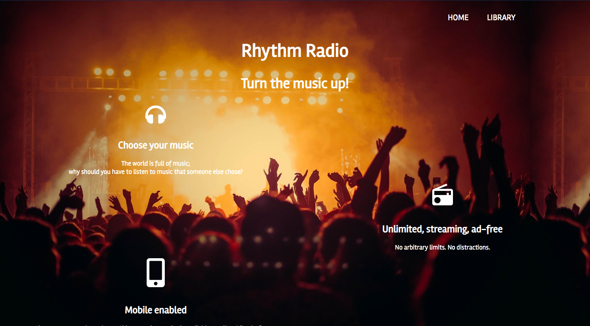
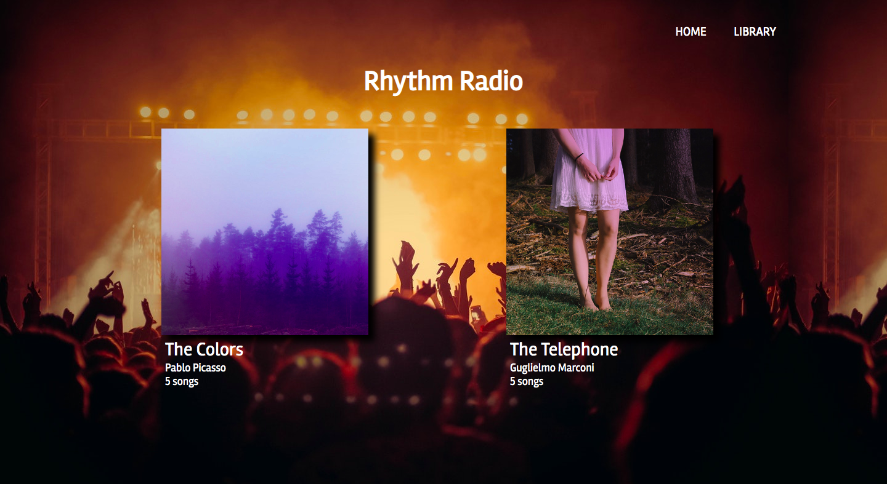
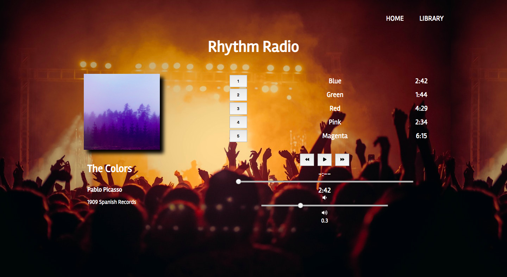

# Rhythm Radio

This project was bootstrapped with [Create React App](https://github.com/facebookincubator/create-react-app).

## Description
Rhythm Radio is a simple music player app built with React.js. Users can listen to instrumental tunes currently included in project data's database. The ideal music app for studying, providing background noise, or having something to nod your head to while riding the elevator, Rhythm Radio is equiped with the most essential music player controls for providing a pleasurable listening experience. 

As a an SPA (Single Page Application), Rhythm Radio utlizes React Router, which allows page transitions to appear cleaner and smoother for users tuning in for a friendly user experience. And it's 100% ad-free! 



## Motivation

Rhythm Radio was inspired by popular music player apps such as Spotify and Pandora. Rhythm Radio's goal is to help users' go about their everyday tasks and activites by providing music/sounds that's purely instrumental, thus pleasant on the ears ;)

## Viewing the Project

View working demo here: https://rhythmradio.herokuapp.com/

# Getting Started

## Prerequisites

* A computer running MacOS, Windows or Linux
* A supported version of Node.js
* Either yarn or npm to manage packages
• React.js installed

Make sure you have React.js installed. The simplest way is through the npm package manager. If you haven't installed npm or Node.js here's a link to a Codecademy article for installing both and getting up and ready with React:

https://www.codecademy.com/articles/react-setup-i

## Installing

How to get a development environment running:

Clone this repo inside a directory on your local machine

`$ git clone https://github.com/ARodriguezHacks/rhythm-radio.git`

or

`$ git clone https://github.com/ARodriguezHacks/rhythm-radio.git your-preferred-name-for-project`

Running `git clone` will create a new directory on your local machine called "Rhythm Radio" unless you specified a different name for the directory. Change directory (`cd`) into your newly cloned directory

`$ cd rhythm-radio` or `$ cd your-preferref-name-for-project`

Next run `npm install` to install the project's dependencies

`$ npm install`

Once `npm install` has finished installing, you can now run the project on your local server

`$ npm start`

And voila!


Then you can run npm start to run the project on your local server.
 
Make sure you have React installed. The simplest way is through the npm package manager. If you haven't installed npm or Node.js here's a link to a Codecademy article for installing both and getting up and ready with React:

https://www.codecademy.com/articles/react-setup-i

## Tech/Framework used
• HTML5 <br />
• CSS3 <br />
• JavaScript (React.js) <br />
• Font Awesome Icon Library <br />

## Features

Seemless navigation thanks to React Router <br />

User-friendy icons accomplished through the Font Awesome library <br />

Set of most essential music player controls (e.g., play, pause, volume) <br />

Ability to add album data to the project inside the `albums.js` file located inside the `data` folder:
```
export default [{
  title: 'The Colors',
  artist: 'Pablo Picasso',
  releaseInfo: '1909 Spanish Records',
  albumCover: '/assets/images/album_covers/01.jpg',
  slug: 'the-colors',
  songs: [
    { title: 'Blue', duration: '161.71', audioSrc: '/assets/music/blue.mp3' },
    { title: 'Green', duration: '103.96', audioSrc: '/assets/music/green.mp3' },
    { title: 'Red', duration: '268.45', audioSrc: '/assets/music/red.mp3' },
    { title: 'Pink', duration: '153.14', audioSrc: '/assets/music/pink.mp3' },
    { title: 'Magenta', duration: '374.22', audioSrc: '/assets/music/magenta.mp3' }
  ]
}, {
    title: 'The Telephone',
    ...
```
**Important: Make sure you have the rights to the music/data in question. Rhythm Radio does NOT support copyright infringement.**

_Upcoming feature: Make Rhythm Radio fully responsive! More updates to come!_





## Contribute

If you would like to contribute to this project please send an email to angrodri902@gmail.com
